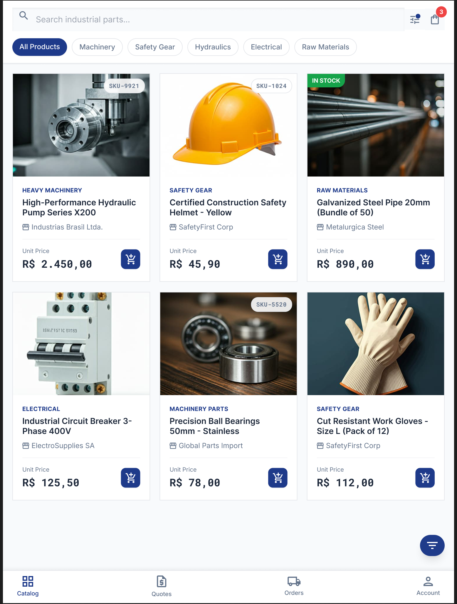

<div align="center">
  
  <br />
  <a href="#key-features">🌐 English</a>&nbsp;&nbsp;|&nbsp;&nbsp;<a href="#visao-geral">🇧🇷 Português</a>
</div>

<h1 align="center">B2B Marketplace</h1>
<p align="center">
  Structured procurement platform for the Brazilian industrial market — verified companies, volume-based quotations, and complete order lifecycle management.
</p>
<p align="center">
  
  
  
  
  
  
</p>

---

<div align="center">
  
</div>

---

## Key Features

- **CNPJ Validation** — Real-time company verification via Brasil API ensures only legitimate businesses transact
- **Role-based Access** — Granular permissions for Buyer, Supplier, and Admin roles with middleware-enforced RBAC
- **Quotation Engine** — Tier-based volume pricing with automated tax and shipping calculations per request
- **Order Lifecycle** — Full status tracking from pending through confirmed, shipped, and delivered
- **Bulk CSV Import** — Suppliers can ingest large product catalogs in a single operation
- **Admin Dashboard** — Company verification queue, platform analytics, and user management
- **JWT Security** — Token-based auth hardened with Helmet, rate limiting, and bcrypt hashing

---

## Tech Stack

| Layer         | Technology                        |
| ------------- | --------------------------------- |
| Frontend      | React 19, TypeScript, MUI, Vite   |
| Backend       | Node.js, Express 5, TypeScript    |
| Database      | PostgreSQL 15, Sequelize ORM      |
| Auth          | JWT, bcrypt, Helmet               |
| File handling | Multer (CSV import, file uploads) |
| External API  | Brasil API (CNPJ validation)      |
| DevOps        | Docker, Docker Compose            |

---

## Getting Started

### Docker (recommended)

```bash
git clone https://github.com/oguarni/CresceBR.git crescebr-b2b-marketplace
cd crescebr-b2b-marketplace

cp backend/.env.example backend/.env
cp frontend/.env.example frontend/.env

docker-compose up --build
```

**Access:** `http://localhost:5173` (frontend) | `http://localhost:3001` (API)

### Local development

```bash
npm run setup   # install all dependencies
npm run dev     # start frontend (5173) + backend (3001) concurrently
```

**Prerequisites:** Node.js 20+, PostgreSQL 15 running locally.

---

## Project Structure

```text
crescebr-b2b-marketplace/
├── frontend/          # React 19 + TypeScript + Vite + MUI
├── backend/           # Node.js + Express 5 + TypeScript + Sequelize
├── shared/            # Shared TypeScript types
├── docs/              # Design prompts and assets
├── docker-compose.yml
└── package.json       # Workspace root
```

---

## Architecture

### Layered Architecture

```text
┌─────────────────────────────────────────────────────────────┐
│                  ROUTES + MIDDLEWARE                        │
│           (auth, rbac, validation, rate-limit)              │
├─────────────────────────────────────────────────────────────┤
│                     CONTROLLERS                             │
│              HTTP request/response handling                 │
├─────────────────────────────────────────────────────────────┤
│                      SERVICES                               │
│              Business logic and orchestration               │
├─────────────────────────────────────────────────────────────┤
│                    REPOSITORIES                             │
│              Data access patterns and queries               │
├─────────────────────────────────────────────────────────────┤
│                  MODELS (Sequelize ORM)                     │
│              Schema definitions and associations            │
└─────────────────────────────────────────────────────────────┘
```

### System Diagram

```text
┌──────────────────┐    ┌──────────────────┐    ┌──────────────────┐
│  React Frontend  │    │ Express Backend  │    │   PostgreSQL     │
│   (Port 5173)    │◄──►│   (Port 3001)    │◄──►│   (Port 5432)    │
└──────────────────┘    └──────────────────┘    └──────────────────┘
                                │
                                ▼
                        ┌──────────────────┐
                        │   Brasil API     │
                        │ CNPJ Validation  │
                        └──────────────────┘
```

---

## API Overview

| Domain     | Endpoints | Description                                         |
| ---------- | --------- | --------------------------------------------------- |
| Auth       | `4`       | Register (buyer/supplier), login, profile           |
| Companies  | `3`       | List, verify, and stats (admin-only)                |
| Products   | `6`       | CRUD, bulk CSV import, template download            |
| Quotations | `5`       | Create, list, detail, update status, process        |
| Orders     | `5`       | Create from quotation, list, history, status, stats |
| Admin      | `3`       | Analytics dashboard, company management             |

**Base URL:** `http://localhost:3001/api`

---

## Development

```bash
npm run dev      # Start frontend + backend
npm run build    # Production build (all)
npm run test     # Run tests in all subprojects
npm run lint     # Lint all subprojects
npm run clean    # Remove node_modules and dist
```

**Backend only:**

```bash
cd backend
npm run dev      # Hot reload dev server
npm run test     # Jest test suite
npm run lint     # ESLint
```

**Frontend only:**

```bash
cd frontend
npm run dev      # Vite dev server
npm run build    # Production build
npm run test     # Vitest suite
```

---

## Demo Credentials

| Role     | Email                  | Password      | CNPJ                 |
| -------- | ---------------------- | ------------- | -------------------- |
| Admin    | `admin@crescebr.com`   | `admin123`    | `11.222.333/0001-81` |
| Supplier | `supplier@example.com` | `supplier123` | `12.345.678/0001-90` |
| Buyer    | `buyer@example.com`    | `buyer123`    | `98.765.432/0001-10` |

---

## Contributing

1. Fork the repository
2. Create a feature branch (`git checkout -b feature/my-feature`)
3. Commit your changes (`git commit -m 'Add my feature'`)
4. Push to the branch (`git push origin feature/my-feature`)
5. Open a Pull Request

---

## License

Licensed under **CC BY-NC-SA 4.0**. See [`LICENSE`](LICENSE) for details.

---

<h2 id="visao-geral">🇧🇷 Visão Geral</h2>

**CresceBR** é uma plataforma de marketplace B2B para o mercado industrial brasileiro. Conecta empresas compradoras e fornecedoras por meio de cotações estruturadas com precificação por volume, verificação de CNPJ em tempo real, e rastreamento completo do ciclo de pedidos.

### Tech Stack

| Camada         | Tecnologia                      |
| -------------- | ------------------------------- |
| Frontend       | React 19, TypeScript, MUI, Vite |
| Backend        | Node.js, Express 5, TypeScript  |
| Banco de dados | PostgreSQL 15, Sequelize ORM    |
| Segurança      | JWT, RBAC, Helmet               |
| Infraestrutura | Docker, Docker Compose          |

### Começando

#### Docker (recomendado)

```bash
git clone https://github.com/oguarni/CresceBR.git crescebr-b2b-marketplace
cd crescebr-b2b-marketplace

cp backend/.env.example backend/.env
cp frontend/.env.example frontend/.env

docker-compose up --build
```

**Acesso:** `http://localhost:5173` (frontend) | `http://localhost:3001` (API)

Para instruções detalhadas de desenvolvimento local, consulte as seções em inglês acima.

---

_CresceBR — Conectando empresas brasileiras._
