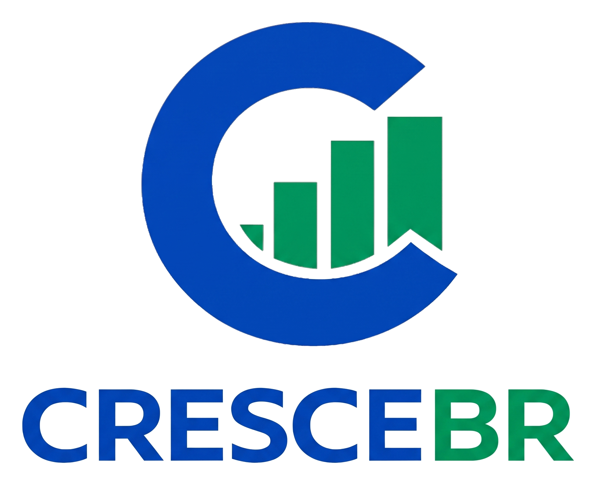
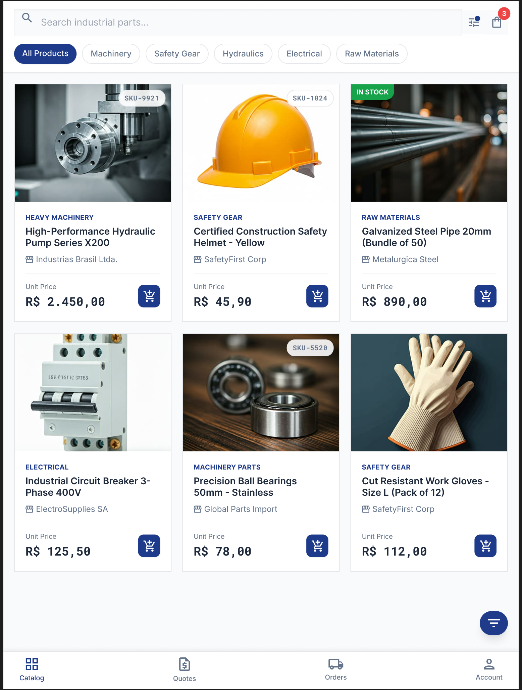

<div align="center">
  
  <br />
  <a href="#key-features">English</a>&nbsp;&nbsp;|&nbsp;&nbsp;<a href="#visao-geral">Português</a>
</div>

<h1 align="center">CresceBR — B2B Marketplace</h1>
<p align="center">
  Structured procurement for the Brazilian industrial market.<br />
  Verified companies. Volume-based quotations. Full order lifecycle.
</p>
<p align="center">
  
  
  
  
  
  <a href="LICENSE"></a>
</p>

---

<div align="center">
  
</div>

---

## Why CresceBR

Brazilian B2B procurement runs on phone calls, spreadsheets, and informal channels. CresceBR replaces that friction with a structured workflow: every company is CNPJ-verified before it can transact, quotations follow tier-based volume pricing, and orders are tracked from request through delivery.

The result is a transparent, auditable procurement platform where buyers find verified suppliers, suppliers manage quotations at scale, and administrators maintain full visibility over every transaction.

---

## Key Features

- **CNPJ Verification** — Real-time company validation via Brasil API; only legitimate businesses participate
- **Role-based Access Control** — Granular permissions for Buyer, Supplier, and Admin roles enforced at the middleware level
- **Quotation Engine** — Tier-based volume pricing with automated tax and shipping calculations
- **Order Lifecycle** — Full status tracking from pending through confirmed, shipped, and delivered
- **Bulk CSV Import** — Suppliers onboard large product catalogs in a single operation
- **Admin Dashboard** — Company verification queue, platform analytics, and user management
- **Security Hardened** — JWT authentication, Helmet headers, rate limiting, and bcrypt hashing

---

## Tech Stack

| Layer         | Technology                        |
| ------------- | --------------------------------- |
| Frontend      | React 19, TypeScript, MUI, Vite   |
| Backend       | Node.js, Express 5, TypeScript    |
| Database      | PostgreSQL 15, Sequelize ORM      |
| Auth          | JWT, bcrypt, Helmet               |
| File handling | Multer (CSV import, file uploads) |
| External API  | Brasil API (CNPJ validation)      |
| DevOps        | Docker, Docker Compose            |

---

## Getting Started

### Docker (recommended)

```bash
git clone https://github.com/oguarni/CresceBR.git crescebr-b2b-marketplace
cd crescebr-b2b-marketplace

cp backend/.env.example backend/.env
cp frontend/.env.example frontend/.env

docker-compose up --build
```

Open `http://localhost:5173` for the frontend and `http://localhost:3001/api/v1` for the API.

### Local development

**Prerequisites:** Node.js 20+, PostgreSQL 15 running locally.

```bash
npm run setup   # install all workspace dependencies
npm run dev     # start frontend (port 5173) + backend (port 3001)
```

---

## Project Structure

```text
crescebr-b2b-marketplace/
├── frontend/          # React 19 + TypeScript + Vite + MUI
├── backend/           # Node.js + Express 5 + TypeScript + Sequelize
├── shared/            # Shared TypeScript types
├── docs/              # Design specs and operational docs
├── docker-compose.yml
└── package.json       # npm workspace root
```

---

## Architecture

```text
┌─────────────────────────────────────────────────────────────┐
│                  ROUTES + MIDDLEWARE                        │
│           (auth, rbac, validation, rate-limit)              │
├─────────────────────────────────────────────────────────────┤
│                     CONTROLLERS                             │
│              HTTP request/response handling                 │
├─────────────────────────────────────────────────────────────┤
│                      SERVICES                               │
│              Business logic and orchestration               │
├─────────────────────────────────────────────────────────────┤
│                    REPOSITORIES                             │
│              Data access patterns and queries               │
├─────────────────────────────────────────────────────────────┤
│                  MODELS (Sequelize ORM)                     │
│              Schema definitions and associations            │
└─────────────────────────────────────────────────────────────┘
```

```text
┌──────────────────┐    ┌───────────────────┐     ┌──────────────────┐
│  React Frontend  │    │  Express Backend  │     │   PostgreSQL     │
│   (Port 5173)    │◄──►│   (Port 3001)     │◄──► │   (Port 5432)    │
└──────────────────┘    └───────────────────┘     └──────────────────┘
                                │
                                ▼
                        ┌──────────────────┐
                        │   Brasil API     │
                        │ CNPJ Validation  │
                        └──────────────────┘
```

---

## API Overview

All endpoints are served under `/api/v1`.

| Domain     | Endpoints | Description                                         |
| ---------- | --------- | --------------------------------------------------- |
| Auth       | 4         | Register (buyer/supplier), login, profile            |
| Companies  | 3         | List, verify, and stats (admin-only)                 |
| Products   | 6         | CRUD, bulk CSV import, template download             |
| Quotations | 5         | Create, list, detail, update status, process         |
| Orders     | 5         | Create from quotation, list, history, status, stats  |
| Admin      | 3         | Analytics dashboard, company management              |

---

## Development

```bash
npm run dev      # Start frontend + backend concurrently
npm run build    # Production build (shared → backend → frontend)
npm run test     # Run tests across all workspaces
npm run lint     # Lint all workspaces
npm run clean    # Remove node_modules and dist
```

**Backend only:**

```bash
cd backend
npm run dev      # Hot reload dev server
npm run test     # Jest test suite
npm run lint     # ESLint
```

**Frontend only:**

```bash
cd frontend
npm run dev      # Vite dev server
npm run build    # Production build
npm run test     # Vitest suite
```

---

## Demo Credentials

These accounts are seeded automatically in the development database. **Do not use these credentials in any production environment.**

| Role     | Email                  | Password      | CNPJ                 |
| -------- | ---------------------- | ------------- | -------------------- |
| Admin    | `admin@crescebr.com`   | `admin123`    | `11.222.333/0001-81` |
| Supplier | `supplier@example.com` | `supplier123` | `12.345.678/0001-90` |
| Buyer    | `buyer@example.com`    | `buyer123`    | `98.765.432/0001-10` |

---

## Documentation

Design specs, operational history, and tooling references live in [`docs/`](docs/):

| Document | Purpose |
| -------- | ------- |
| [Maturity Improvements](docs/MATURITY_IMPROVEMENTS.md) | Security fixes, testing, and business logic enhancements |
| [Prioritized Action Plan](docs/prioritized-action-plan.md) | Current backlog ranked by priority |
| [Frontend Design Spec](docs/design-prompt.md) | Visual language and page layouts |

---

## Contributing

1. Fork the repository
2. Create a feature branch from `main` (`git checkout -b feature/your-feature`)
3. Write tests for any new functionality
4. Ensure all checks pass: `npm run build && npm run lint && npm run test`
5. Commit with a clear, descriptive message in English
6. Open a Pull Request against `main`

Follow the existing conventions: TypeScript strict mode, ESLint + Prettier formatting, and the layered architecture described above. Domain-specific guidance is available in `backend/CLAUDE.md` and `frontend/CLAUDE.md`.

---

## License

Licensed under [CC BY-NC-SA 4.0](LICENSE).

---

<h2 id="visao-geral">Português</h2>

**CresceBR** é uma plataforma de marketplace B2B para o mercado industrial brasileiro. Conecta empresas compradoras e fornecedoras por meio de cotações estruturadas com precificação por volume, verificação de CNPJ em tempo real e rastreamento completo do ciclo de pedidos.

### Destaques

- **Verificação de CNPJ** — Validação em tempo real via Brasil API
- **Controle de Acesso** — Permissões granulares para Comprador, Fornecedor e Administrador
- **Motor de Cotação** — Precificação por volume com cálculo automático de impostos e frete
- **Ciclo de Pedidos** — Rastreamento completo do pedido até a entrega
- **Importação CSV** — Catálogo de produtos em massa
- **Painel Administrativo** — Verificação de empresas, analytics e gestão de usuários

### Como começar

```bash
git clone https://github.com/oguarni/CresceBR.git crescebr-b2b-marketplace
cd crescebr-b2b-marketplace
cp backend/.env.example backend/.env
cp frontend/.env.example frontend/.env
docker-compose up --build
```

**Acesso:** `http://localhost:5173` (frontend) | `http://localhost:3001/api/v1` (API)

Para instruções detalhadas de desenvolvimento, consulte as seções em inglês acima.

---

_CresceBR — Conectando empresas brasileiras._
